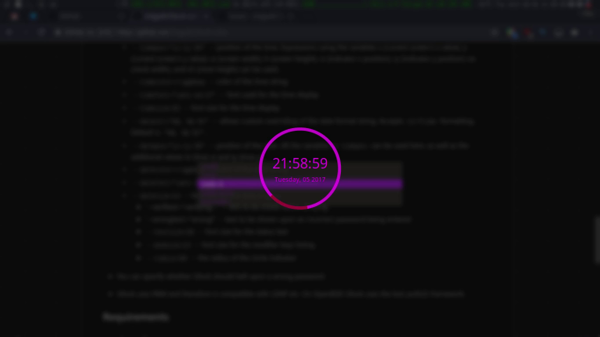

# i3lock - improved screen locker


**A modern version of i3lock with color functionality by [eBrnd](https://github.com/eBrnd/i3lock-color), maintained for a few years by [PandorasFox](https://github.com/PandorasFox) and now maintained and being developed by [Raymo111](https://github.com/Raymo111).**



i3lock is a simple screen locker like slock. After starting it, you will see a white screen (you can configure the color/an image). You can return to your screen by entering your password.

Many little improvements have been made to i3lock over time:

- i3lock forks, so you can combine it with an alias to suspend to RAM (run "i3lock && echo mem > /sys/power/state" to get a locked screen after waking up your computer from suspend to RAM)
- You can specify either a background color or an image (JPG or PNG), which will be displayed while your screen is locked. Note that i3lock is not an image manipulation software. If you need to resize the image to fill the screen, you can use something like ImageMagick combined wih `xdpyinfo`:
	```bash
	convert image.jpg -resize $(xdpyinfo | grep dimensions | sed -r 's/^[^0-9]*([0-9]+x[0-9]+).*$/\1/') RGB:- | i3lock --raw $(xdpyinfo | grep dimensions | sed -r 's/^[^0-9]*([0-9]+x[0-9]+).*$/\1/'):rgb --image /dev/stdin
	```
- You can specify whether i3lock should bell upon a wrong password.
- i3lock uses PAM and therefore is compatible with LDAP etc. On OpenBSD, i3lock uses the bsd\_auth(3) framework.

## Additional features in i3lock-color
You can also specify additional options, as detailed in the manpage. This includes, but is not limited to:

- Color options for:
	- Verification ring
	- Interior ring color
	- Ring interior line color
	- Key highlight color
	- Backspace highlight color
	- Text colors for most/all strings
	- Changing all of the above depending on PAM's authentication status
- Blurring the current screen and using that as the lock background    
- Showing a clock in the indicator
- Refreshing on a timer, instead of on each keypress
- Positioning the various UI elements
- Changing the ring radius and thickness, as well as text size
- Passthrough media keys
- A new bar indicator, which replaces the ring indicator with its own set of options
	- An experimental thread for driving the redraw ticks, so that things like the bar/clock still update when PAM is blocking

## Dependencies
The following dependencies will need to be installed for a successful build, depending on your OS/distro.

### Ubuntu 18.04 LTS
Run this command to install all dependencies:
```
sudo apt install pkg-config libpam0g-dev libcairo2-dev libfontconfig1-dev libxcb-composite0-dev libev-dev libx11-xcb-dev libxcb-xkb-dev libxcb-xinerama0-dev libxcb-randr0-dev libxcb-image0-dev libxcb-util-dev libxcb-xrm-dev libxkbcommon-dev libxkbcommon-x11-dev libjpeg-dev
```

## Arch Linux
- autoconf
- cairo
- fontconfig
- libev
- libjpeg-turbo
- libxinerama
- libxkbcommon-x11
- libxrandr
- pam
- pkgconf
- xcb-util-image
- xcb-util-xrm

## Building i3lock-color
Before you build - check and see if there's a packaged version available for your distro (there usually is, either in a community repo/PPA).

If there's no packaged version available - think carefully, since you're using a forked screen locker at your own risk.

**If you want to build a non-debug version, you should tag your build before configuring.** For example: `git tag -f "git-$(git rev-parse --short HEAD)"` will add a tag with the short commit ID, which will be used for the version info. Issues asking about ASAN/complaints about i3lock-color being slow / etc will likely be closed. i3lock-color uses GNU autotools for building.

To use i3lock-color, first install the dependencies listed above, then clone the repo:
```
git clone https://github.com/Raymo111/i3lock-color.git
cd i3lock-color
```
To build without installing, run:
```
chmod +x build.sh
./build.sh
```
To install after building, run:
```
chmod +x install-i3lock-color.sh
./install-i3lock-color.sh
```
You may choose to modify the script based on your needs/OS/distro.

## Arch Linux Packages
[Stable version in Community](https://www.archlinux.org/packages/community/x86_64/i3lock-color/)

[Git Version on AUR](https://aur.archlinux.org/packages/i3lock-color-git/)

## FreeBSD port
[i3lock-color-port](https://github.com/rkashapov/i3lock-color-port/)

## Running i3lock-color
Simply invoke the 'i3lock' command. To get out of it, enter your password and press enter.

A [sample script](lock.sh) is included in this repository. [See the script in action](https://streamable.com/fpl46)

On OpenBSD the `i3lock` binary needs to be setgid `auth` to call the authentication helpers, e.g. `/usr/libexec/auth/login_passwd`.

## Upstream
Please submit pull requests for i3lock things to https://github.com/i3/i3lock and pull requests for additional features on top of regular i3lock at https://github.com/Raymo111/i3lock-color.
